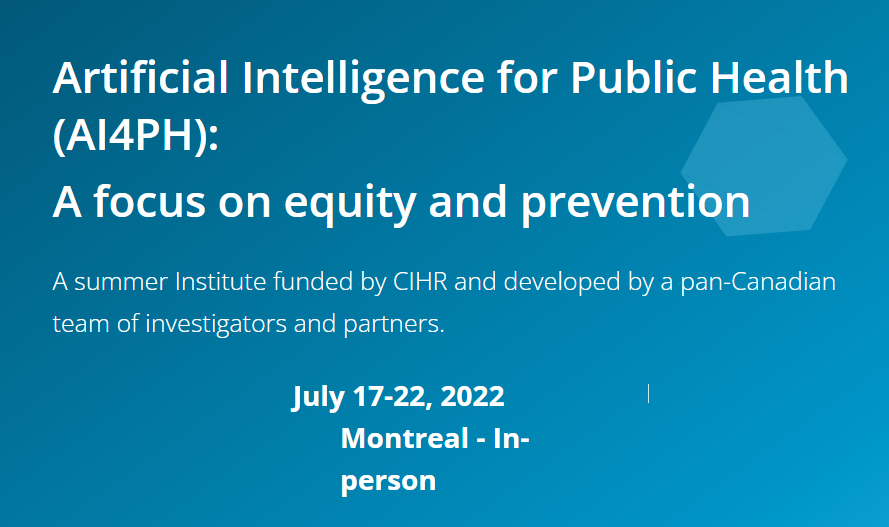

--- 
title: |
    | AI4PH: Text Analyses with R 
    | Tutorial and Data Challenge
author: "[Yuan Tian](https://www.linkedin.com/in/yuan-tian-37256727/), Ph.D(c)"
date: "`r Sys.Date()`"
site: bookdown::bookdown_site
documentclass: book
bibliography: C:\\Users\\tiany\\Google Drive\\Obsidian Vaults\\Paperpile\\paperpile.bib
biblio-style: apalike
link-citations: yes
description: "Welcome to AI4PH Summer Institute 2022."
---

# Preface {-}

The material is prepared for the tutorial session of the AI4PH event 2022.

**Please do not cite or distribute without author's permission.**